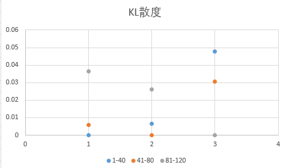
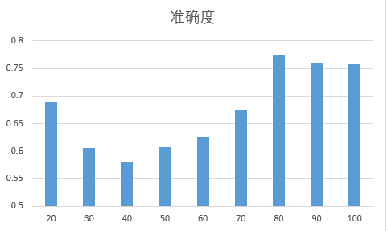
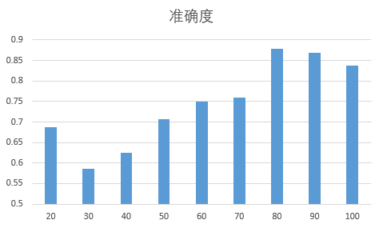

# 判断红楼梦前80回与后40回是否一人所写

## 环境说明

操作系统: Ubuntu 16.04 LTS

Python版本: 3.5.2

使用的包: nltk,jieba,scikit-learn

## 目录结构

- handout
    - img
        - KL.png-KL散度图
        - single.png-单字虚词的准确度
        - svm.png-结巴分词高频词特征的准确度
    - text
        - all.txt-完整的文本
        - chapter[n].txt-第[n]回的文本
    - calcKL.py-计算KL散度的源代码
    - divideChapter.py-将完整文本按回目分割的源码
    - jiebaFreq.py-结巴分词后查找高频词的源码
    - jiebasample.txt-手工作出的用于查找高频词的样本
    - jiebaSVM.py-使用SVM根据高频词特征进行分类和测试的源码
    - report.md-本文件
    - report.pdf-本文件编译出的pdf文档（此为正式报告）
    - singleClassifier.py-单字虚词的朴素贝叶斯分类器源码
    - singlef.txt-单字虚词的词频
    - singleFreq.py-按字进行分词并计算单字虚词词频的源码
    - singleSVM.py-单字虚词的SVM分类器源码
    - singleTest.py-统计所有回目单字词频的源码
        

## 源文本处理

由于红楼梦作者已经去世超过100年，故已不存在版权问题，从网上下载了一个精校的版本使用。由于校对者进行了一些便于阅读的排版，首先要对其进行一定的处理，同时为了后续的分类工作，将120回分成120个单独的文件存储，并且人工审核是否分对。该部分源码在`divideChapter.py`中。

## 第一次试验

### 特征选择

由于红楼梦半文半白的特点，注意到文言文写作的一个特点是会使用许多虚词，虚词大多是一个字的，这里首先采用一字一词的方法统计词频，利用虚词作为特征进行分类统计。
统计词频后选出出现次数在100以上的字，并且根据古文常用虚词与之比较，选取如下几个虚词作为特征。

之、其、或、亦、于、即、皆、因、仍、故、尚、乃、吗、罢、了、的、着、一、不、把、向、是、在、可、便、但、越、比、很、偏

为了验证这个思路的有效性，希望先通过一个粗略但便于实现的方法估计这个特征的分布情况，想到使用KL散度，以40回为一块，研究两两之间的相对熵，看是否存在后40回和前两块差距大的情况，计算程序在`calcKL.py`中。

KL散度是衡量两个概率分布差异的一个指标，又称为相对熵，具体的计算方法为，若P(x),Q(x)是X取值的两个离散分布，则P对Q的相对熵为我以当前虚词出现次数与所有备选虚词出现的总数的比作为概率，算出三个块中各自的虚词分布的概率，以此作为求相对熵的参数，观察这其中的分布的差异性，如果是相同写作习惯的人写了全部120回，则两两之间的相对熵应该都相似。

下面是散度的图像



从图中可以很容易的看出，在以这些虚词为特征时，第一块和第二块的相对熵是比较小的，而这两块和第三块的相对熵都相对大一些，这意味着通过这些虚词是可以区分出前80回和后40回的，在文本中虚词出现的频率分布出现了较大的差异，故而进一步使用机器学习方法进行分类试验，用更精确的拟合方式来检验用词习惯的差异。


### 分类试验

在前80回和后40回中各随机选取20回作为训练数据训练朴素贝叶斯分类器，然后对剩下的回目进行分类，看是否能通过这些虚词来区分出前80回和后40回。其中，选取的特征为上述虚词在回目中出现的次数，以此构造一个二分类的分类器，分为前80回和后40回两类，分别用0和1表示。该部分代码在`singleClassifier.py`中。

使用nltk提供的NaiveBayesClassifier，由于中间采用了随机的回目，故准确度会有波动，多次测试后的平均准确度约为0.68，而由于只有两类，实际上随机都有0.5的准确率，可见通过虚词使用频率来分类不够准确。

为了比较，我再次尝试了将切割点分别放在40,60,80回，看准确率是否会下降，如果总体来说80回切割时的准确度最高，则也可以在一定程度上说明80回前后的差距最大，否则的话，就无法排除虚词的使用频率会随着情节发展而变化这一影响因素。

下面是我重复测试100次后的平均准确度

{40: 0.6140000000000001, 60: 0.6115000000000003, 80: 0.68525}

这里可以看出，40回和60回的准确度是非常接近的，这说明根据虚词来分基本的准确率大概就在这个水平，比0.5高的原因可能是因为情节发展等因素的影响，而以80回作为分割点会有大约0.07的准确率的提升，高了约10%，这10%的影响是情节因素等以外的影响，故我认为这可以作为《红楼梦》大体前80回和后面的回目作者的用词风格发生改变的一个证据。

考虑的特征维度和训练样本数量关系相当，大致有30个特征，而样本数量也只有40个，根据经验在这种情况下朴素贝叶斯分类器表现会比较差，考虑到支持向量机可以处理这种情况，尝试使用SVM作为分类器而不是使用朴素贝叶斯分类器,这里调用了scikit-learn提供的SVM分类器，代码部分在`singleSVM.py`中。由于scikit-learn没有提供测试准确度的函数，我自行设计了一个，参数包括测试的分割点的起始回目`start`，终点回目`end`，分割点变化的步长`step`以及每一类中选取的训练样本的数量`trainSize`，这样会便于测试不同的情况。而由于本次的判断任务比较简单，我认为不需要考虑召回率和准确率，直接以测试集中判断正确的比例作为评判标准，这里要注意的是测试集中不能含有训练样本，我本次采取的是120回中去除所有的训练样本后作为测试集。

运用和贝叶斯分类器相同的方案进行测试,测试结果如下

{40: 0.579625, 80: 0.8237499999999999, 60: 0.6611250000000001}

效果提升非常显著，由此可见，在这种训练样本较少而特征维度并不少的情况下，SVM有较为优秀的表现，而在80回时精确度的显著提高，也可以表明在80回时虚词的使用习惯产生了明显的区别，或者说此时两类样本的特征向量差异最大。故而在后续试验中，我将舍弃朴素贝叶斯分类，转而使用SVM分类器。

在上述结果中，还存在一个问题，就是精确度是随着回目的增多而增多的，我无法保证这里面没有情节的影响，为了验证这一点，需要把分割点继续推后，而由于回目数量的原因，我将把训练集进一步缩小，前80回和后40回各取10回，分割点从20回以10回一次递增到100回查看结果，测试代码在`singleSVM.py`中，只需修改一些函数的参数就可以，100次的平均结果如下

{20: 0.6892, 30: 0.6056, 40: 0.5803999999999996, 50: 0.6064, 60: 0.6255000000000002, 70: 0.6747999999999998, 80: 0.7752000000000002, 90: 0.7601999999999997, 100: 0.7574}



可以看出，准确度的分布基本符合一个以80回为峰顶的驼峰，如此可以排除情节的影响，认为《红楼梦》120回通行本在80回时写作的虚词使用习惯出现了明显的转变。


## 第二次试验

### 特征选取

第一次试验中，我们只使用了相对偏向文言文的虚词特征，考虑到红楼梦里很多表达已经和传统的文言文有所区别，更接近于现代的白话文，仅仅用文言文中之乎者也那一套的先验知识来选取特征不是特别妥当，故尝试一下使用结巴分词，考虑到样本数量和SVM的特性，特征数量应不超过样本数量太多，故取前100个高频词并手工删去一些明显分错或不合理的词作为特征。此外，考虑到特征选取的bias问题，我采取前80回和后40回各取10回来作为统计词频的样本，具体统计在`jiebaFreq.py`中。这里为了保证采样的一致性和便捷性，我手动集合了前80回中8的倍数的回目和后40回中4的倍数的回目到一个文件`jiebasample.txt`中.

统计出的100个高频词如下

``` python
[('，', 9244), ('。', 4697), ('了', 3368), ('的', 2574), ('：', 2256), ('”', 2142), ('“', 2140), ('我', 1308), ('道', 1182), ('他', 1158), ('说', 1040), ('是', 1024), ('也', 987), ('你', 947), ('？', 907), ('又', 812), ('\u3000', 802), ('着', 693), ('来', 636), ('去', 634), ('宝玉', 621), ('不', 594), ('在', 496), ('便', 493), ('人', 428), ('有', 415), ('都', 406), ('叫', 405), ('就', 400), ('呢', 394), ('笑', 393), ('！', 384), ('这', 375), ('那', 326), ('还', 298), ('要', 294), ('什么', 291), ('好', 282), ('听', 266), ('等', 255), ('贾母', 249), ('一个', 248), ('见', 240), ('那里', 232), ('到', 229), ('儿', 227), ('和', 224), ('凤姐', 219), ('‘', 215), ('’', 214), ('我们', 212), ('、', 209), ('只', 205), ('老太太', 205), ('上', 202), ('才', 202), ('贾琏', 201), ('给', 200), ('没有', 189), ('把', 187), ('倒', 183), ('个', 176), ('罢', 173), ('这里', 173), ('们', 170), ('问', 168), ('说道', 167), ('事', 167), ('王夫人', 163), ('如今', 160), ('鸳鸯', 159), ('听见', 158), ('你们', 158), ('看', 156), ('不知', 155), ('姑娘', 154), ('做', 150), ('走', 149), ('怎么', 146), ('出来', 144), ('他们', 141), ('不是', 140), ('奶奶', 138), ('老爷', 138), ('将', 137), ('一面', 136), ('起来', 136), ('知道', 136), ('得', 135), ('；', 133), ('再', 133), ('拿', 133), ('吃', 133), ('因', 132), ('就是', 130), ('没', 130), ('忙', 129), ('请', 128), ('这个', 126), ('只见', 125)]
```

分词之后手动筛选掉标点和受情节影响较大的人名等，剩下的特征集为

`['了', '的', '我', '道', '他', '说', '是', '也', '你', '又', '着', '来', '去', '不', '在', '便', '人', '有', '都', '叫', '就', '呢', '笑', '这', '那', '还', '要', '什么', '好', '听', '等', '一个', '见', '那里', '到', '儿', '和', '我们', '只', '上', '才', '给', '没有', '把', '倒', '个', '罢', '这里', '们', '问', '说道', '事', '如今', '听见', '你们', '看', '不知', '姑娘', '做', '走', '怎么', '出来', '他们', '不是', '奶奶', '老爷', '将', '一面', '起来', '知道', '得', '再', '拿', '吃', '因', '就是', '没', '忙', '请', '这个', '只见']`

分完词之后的任务就相对重复了，只需要用新的特征集训练SVM并测试分类效果即可,这里采用和第一次相同的从20回跑到100回的方案查看结果

{20: 0.687, 30: 0.5860000000000001, 40: 0.6240000000000001, 50: 0.707, 60: 0.7490000000000001, 70: 0.76, 80: 0.8789999999999999, 90: 0.8690000000000001, 100: 0.837}



可以看出，仍然是在80的位置准确度达到了最高点，而且和只用虚词比较，这次的准确度达到了0.879，是一个相对好看的数字了。

## 数据分析

在本次实验中对现在通行的120回版《红楼梦》文本进行了分析，我通过两种特征提取方法，一种针对虚词，一种针对结巴分词后的高频词，首先使用了KL散度这个统计量，粗略观察到用词的分布确实存在前80回的一致性以及和后40回的差异，然后用朴素贝叶斯和svm方法，各自训练了模型，得到分类之后对测试集中回目归属于前80回还是后40回的预测结果，并将结果可视化，可以发现，准确度的最高点大体是在80回的位置，并且在选取了合适的特征和合适的分类方法之后，在测试集上的表现最好能达到87.9%的准确度，意味着该特征能够很好的区分出写作风格。再回头看第二次选取的特征，都是一些很常用的字或词，并且还去掉了人名，可以认为这些词的使用受情节影响是比较小的。排除这些因素，那么剩下的影响因素便是作者的写作习惯，所以可以比较自然地得出一个结论，现在通行的120回本《红楼梦》的大体前80回和剩余回目的作者不是同一个人，有着差异较大的写作习惯。

## 实验反思

本次实验中，我通过使用统计学方法和简单的机器学习工具，选取一些用词的分布特征，检验出《红楼梦》前80回和剩余回目可能不是一人所写的，因为存在着比较大的用词习惯差异，最后最好的分类准确度也达到了87.9%，算是一个相对可以的数字，但是这其中也有很多问题。首先，即使使用了针对中文的结巴分词来统计词频，由于红楼梦的特性，仍然存在很大的局限性，结巴分词的模型是使用现代汉语的语料训练的，和红楼梦的表达不是太匹配，导致了大部分高频词还是一个字的，其中也包括一些虚词，最好能够有更多同时代同类型的语料，自己构造一个字典；第二，在第二次的特征中，仍然存在“笑”这种词，而众所周知，红楼梦是描绘贾府兴衰的，在衰落过程中这个“笑”会不会少一点不得而知，但我考虑到统计词频是均匀选的，甚至后40回密度更大，故而没有舍弃这一词，但具体是否会有影响也不得而知；最后，这次只是从单纯的字和双音节词来考虑，而清代小说中其他至关重要的要素限于能力我没能考虑到，比如诗歌的韵脚，人物的情感分析等，在红楼梦探轶学中也有考虑章回结构的，如果能够通过文本对人物情感和行文的感情色彩进行较为准确的分析，然后观察其走向和整体性，可能有意想不到的发现。据我所知，在前80回中，是以9回为一个整体，18回为一个大单元，而54回为转折点的，如果可以分析出来感情色彩，那么应该能在80回的时候看到一个非常不和谐的转折，希望在后面的学习中我可以有能力对这些特征进行分析。

<br/><br/>
## 参考文献
https://zhuanlan.zhihu.com/p/21421723

https://github.com/fxsjy/jieba

https://baike.baidu.com/item/%E7%9B%B8%E5%AF%B9%E7%86%B5/4233536?fr=aladdin

http://scikit-learn.org/stable/modules/generated/sklearn.svm.LinearSVC.html#sklearn.svm.LinearSVC
